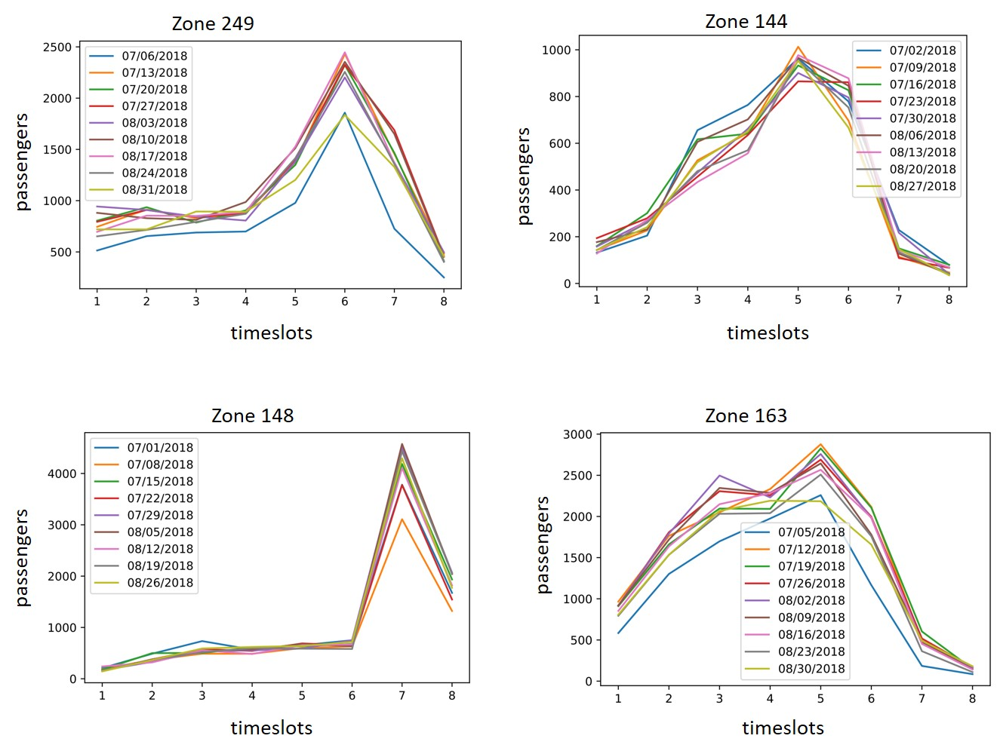
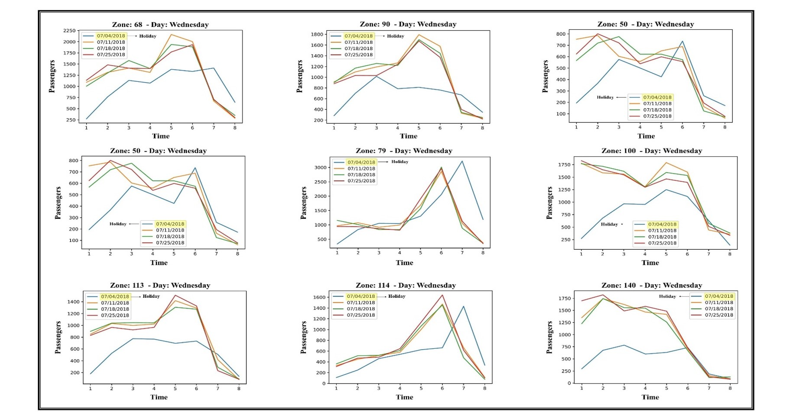
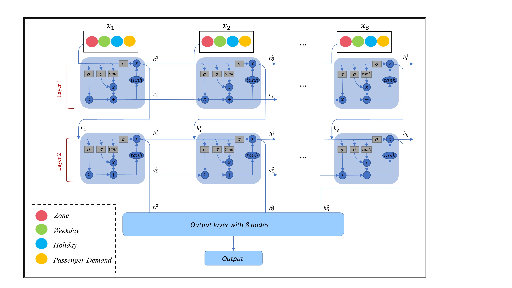

### Status

# Dynamic-Occupancy-Rate-for-Shared-Taxi-Mobility-on-Demand-Services-through-LSTM-and-PER-DQN
1. the LSTM model is used to predict the passengers' demand.
2. the PER-DQN model is used to learn the taxi.

the codes are written with **Python 3**

## Table of Content
- [Long Short-Term Memory](#LSTM)
- [Prioritized Experience Replay - Deep Q Network (PER-DQN)](#PER-DQN)

### Long Short-Term Memory

The number of passengers has approximately the same pattern in the same time and zone. As you can see in zone 249, the passenger demand pattern is mostly the same on all Fridays; likewise, in zone 144, all Mondays are approximately the same.

However, this pattern can change dramatically on special occasions like a public holidays. therefore, we considered the effect of public holidays on our passenger demand prediction

About 22 million yellow taxi records in Manhattan during the three months of July, August, and September 2018 were used to predict the passengers' demand.
**The LSTM model** has 2 hidden layers and 32 neurons.

### Prioritized Experience Replay - Deep Q Network (PER-DQN)

